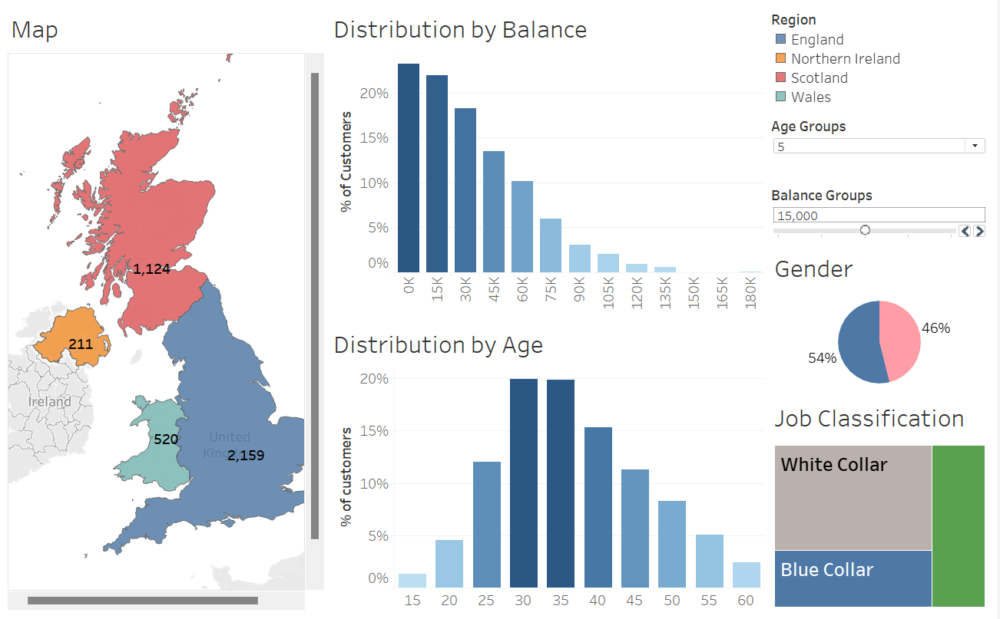

# UK Bank Customers Data Analysis Dashboard
## Overview

Welcome to the UK Bank Customers Data Analysis Dashboard GitHub repository! This project focuses on exploring and visualizing a dataset related to UK bank customers using Tableau. The dashboard provides valuable insights into customer demographics, transaction patterns, and other key metrics.

## Tableau Public Link

🔗 [Tableau Public Dashboard](https://public.tableau.com/app/profile/paridhi.jain2013/viz/BankCustomersDataset_17046302595410/Dashboard1?publish=yes)

## Dashboard Highlights

- **Age and Population Distribution:** Analyze the distribution of customers based on age and population, providing insights into the age demographics of the customer base.
- **Balance Distribution:** Explore the distribution of customer balances to understand the financial health of the customer population.
- **Male-Female Ratio:** Investigate the gender distribution among bank customers, highlighting the male-female ratio.
- **Job Classification (White Collar vs. Blue Collar):** Classify customers into white-collar and blue-collar based on job information, providing insights into occupational demographics.

## Dataset

The dataset used for this analysis contains information about UK bank customers, including details such as customer ID, age, gender, location, account type, income, and transaction history.

## How to Use the Dashboard

1. **Access the Tableau Public Link:** Visit the provided Tableau Public link to interact with the dashboard in your web browser.
2. **Explore Tabs:** Navigate through different tabs in the dashboard to explore various aspects of the data.
3. **Filter and Interact:** Use interactive filters and elements to tailor the view according to your preferences.
4. **Gain Insights:** Leverage the visualizations to gain insights into customer demographics, transactions, and patterns.

## Screenshots

## Contributing

If you'd like to contribute to this project, feel free to fork the repository, make your changes, and submit a pull request. We welcome any improvements, bug fixes, or additional features!
